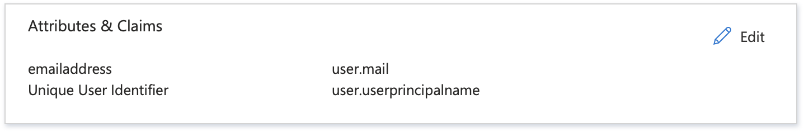

# Configuration

The following details should enable you to configure TeachingHOW2s with any SAML2-compatible identity provider. We also have dedicated guides to configuring TeachingHOW2s with specific identity providers:

- [Azure](../providers/azure)
- [Google Apps](../providers/google)

## Service Provider Settings

When SSO is enabled for your organisation you will be sent the following details:

- **Metadata URL/Entity ID**
- **Assertion Consumer Service/SSO URL**
- **TeachingHOW2s X.509 Certificate**
- Single Logout URL
- Launch URL

Within your identity provider, create a new SAML web app and populate the settings that are highlighted in bold above.

If you would like to take advantage of Single Logout -- where your users are automatically logged out of the HOW2s when they log out of your identity provider, and vice versa -- you should also populate the Single Logout URL.

The Launch URL is generally not required as part of your app configuration, but we'll use it to test SSO and it will also be suitable for use with [application tiles](../application-tiles) once SSO goes live.

## NameID

For NameID values our default configuration requires a unique email address only. Most identity providers will give you the option to simply select 'email' formatting, but if you need to specify the exact format it should be:

    urn:oasis:names:tc:SAML:1.1:nameid-format:emailAddress

## Additional Attributes/Fields/Claims

Since user provisioning is [handled separately](../provisioning) we only require a unique NameID. You do not need to configure any further attributes.

## Custom Name ID/UserPrincipalName Support

If your organisation uses some form of internal UserPrincipalName with values that are separate (or potentially separate) from email addresses then let us know and we'll enable support for separate SSO ID/UPN and email values for your users. 

Organisations with this feature enabled will need to include both SSO ID/UPN and email values when importing users.

End users will use `SSO ID/UPN` to log in via your identity provider and any notifications will be sent to `email`. Conversely, it will not be possible to log in with `email`, nor will the app ever send any notifications to `SSO ID/UPN`.

When SSO ID/UPN support is enabled you can optionally choose to include a secondary email claim. When this is present we will automatically correct any out-of-date email values as and when users log in.

There are both pros and cons to enabling this functionality. The simplicity of a unified email field is often preferable – we'll be happy to discuss which approach is the best fit for your organisation.

## Assignment

All staff users should be granted access to the TeachingHOW2s app.
