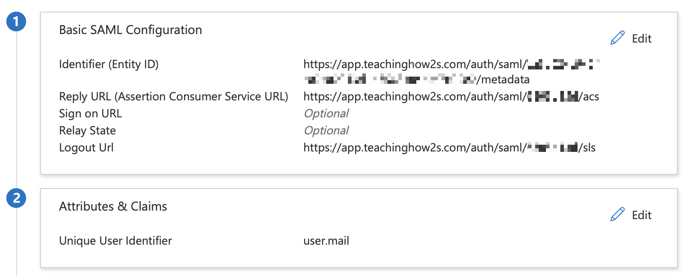

# Azure

!!! note ""

    If you haven't already been sent SAML configuration details please [contact us](mailto:support@teachinghow2s.com) and we'll enable SSO for your organisation.

## Create an Enterprise Application

- Log in to [Azure Active Directory](https://portal.azure.com/){ target="_blank" }
- Browse to Enterprise Applications → New Application → Create your own application
- Create a 'TeachingHOW2s' application, selecting the non-gallery integration option

## Configure SSO

- Browse to Manage → Single sign-on → SAML
- Populate the configuration settings using the details we've provided. See the screenshot below for reference.
- Assign `user.mail` as the Name ID. No additional claims are required.
- [Send us](mailto:support@teachinghow2s.com) the app's Login URL, Azure ID Identifier, Logout URL and a copy of your Base64-encoded certificate.
- If you don't already have HOW2 access, let us know the Azure email address you'll be testing with and we'll create a corresponding HOW2 account for you.
- Once we've updated your configuration settings on our side you'll be able to test SSO logins via your Launch URL.
- Once we've confirmed that SSO launch requests are working reliably we'll disable test mode. This is the final stage of the configuration process and will disable password authentication for all of your users.

## Grant App Access

- Browse to Manage → Users and Groups
- Select '+ Add user/group'
- Select a suitable group, then select Assign

We [recommend](../../provisioning) assigning a group that contains all staff users.
