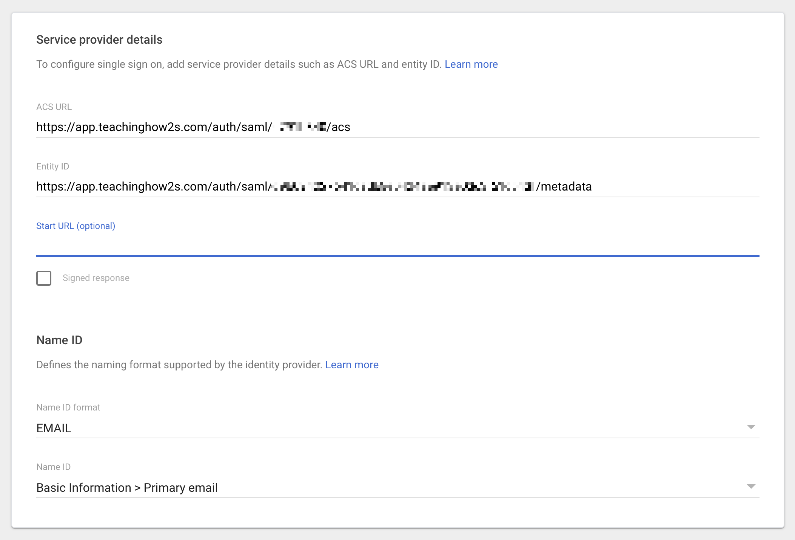

# Google Apps

!!! note ""

    If you haven't already been sent SAML configuration details please [contact us](mailto:support@teachinghow2s.com) and we'll enable SSO for your organisation.

## Create a Custom SAML app

- Log in to the [Google Apps Admin Console](https://admin.google.com/){ target="_blank" }.
- Browse to Apps → Web and mobile apps → Add App → Add custom SAML app.
- Create a TeachingHOW2s app (you can use one of our [application icons](../../application-tiles))
- [Send us](mailto:support@teachinghow2s.com) the app's SSO URL, Entity ID and a copy of your its certificate.
- If you don't already have HOW2 access, let us know the Azure email address you'll be testing with and we'll create a corresponding HOW2 account for you.
- Populate the service provider details using the details we've provided. See the screenshot below for reference.
- Skip the Attribute mapping stage -- we [only require a unique email address](../../configuration#nameid) -- and select Finish.

## Testing

- Once we've updated your configuration settings on our side you'll be able to test SSO logins via your Launch URL.
- Once we've confirmed that SSO launch requests are working reliably we'll disable test mode. This is the final stage of the configuration process and will disable password authentication for all of your users.

## Grant App Access

- Select the TeachingHOW2s app in 'Web and mobile apps'
- Select 'User access'
- Select a suitable group, then select Assign

We [recommend](../../provisioning) assigning a group that contains all staff users.
